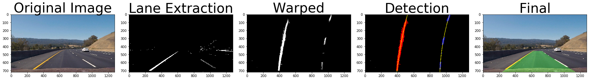
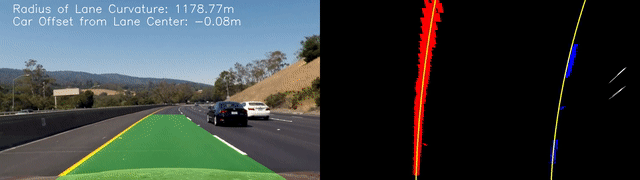

# **Advanced Lane Finding**

Project to find the centered lane of the road in images using computer vision.

Full description of problem and task: [TASK.md](TASK.md)  
Source code: [Advanced_Lane_Finding.ipynb](Advanced_Lane_Finding.ipynb)  
Writeup: [WRITEUP.md](WRITEUP.md)  
Videos: [videos/](videos/)  

## Example Images of Lane Detection Pipeline:

## Demo gif showing the lane detection on the project video:  

